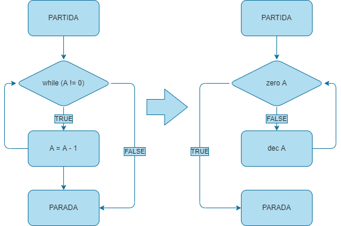

# Documentação da Máquina Norma
## Introdução
 ---

## formato das instruções e sintaxe
 --- 

O programa para máquina norma deve ser estruturado com um espaço chamado de main, para a execução do programa principal, assim como em outras linguagens de programação, como C ou C++.

exemplo:

    main{
        1: do inc  A goto 0
    }

Toda instrução da máquina norma deve seguir o seguinte padrão: deve iniciar por um rótulo(_label_) seguido de ":", em seguida, poderá vir "_do_" caso a instrução execute uma operação, ou "_if_" caso a instrução seja um teste. Em seguida, a operação desejada, podendo ser alguma das operações e testes nativos da máquina Norma (inc A, dec B, zero B, etc.), ou subrotinas desenvolvidas pelo programador. Por fim, a instrução deve terminar com o rótulo da próxima instrução a ser executada. No caso de condicionais, deve haver o rótulo para a próxima instrução caso o teste seja verdadeiro e outro para caso o teste seja falso. Além disso, após indicado o teste, ele deve ser seguido de "_then_".

Para instruções que indicam operações, escrevemos

    rótulo1: do operação1 goto rótulo2

para os testes, temos 

    rótulo1: if test1 then goto rótulo2 else goto rótulo3

### exemplo de implementação:

    main{
        1: do inc  A goto 2
        2: if zero B then goto 3 else goto 0
        3: do inc  B goto 0
    }
### subrotinas:
As subrotinas são implementadas como funções ou procedimentos, semelhante a outras linguagens de programação: uma palavra-chave que indica se é uma operação ou um teste, o nome da subrotina e os registradores utilizados.

exemplo 1:

    test both_zero(A, B){
        1: if zero A then goto 2 else goto false
        2: if zero B then goto true else goto false
    }

exemplo 2:

    operation mov(A, B){
        1: if zero A then goto 3 else goto 2
        2: do dec  A goto 1
        3: if zero B then goto 0 else goto 4
        4: do inc  A goto 5
        5: do dec  B goto 3
    }

_observação:_ os nomes dos registradores utilizados como parâmetro das funções são parâmetros formais da subrotina, ou seja, podem ser substituidos por outros na chamada da subrotina. Por exemplo, a chamada da subrotina `both_zero` pode ser dada da seguinte forma:

    1: if both_zero(X, Y) then goto 2 else goto 3

mesmo que a subrotina tenha sido definida como `both_zero(A, B)`.

O retorno das subrotinas é dado quando é indicado um goto 0, no caso de uma operação, ou um goto false ou goto true, no caso de um teste.

É possível chamar uma subrotina dentro de outra subrotina, porém NÃO é possível realizar uma chamada recursiva, ou seja, uma subrotina chamar a si mesma.

### detalhes de sintaxe:
* Os rótulos devem começar com um dígito;
* O primeiro rótulo é, por convenção, 1, já o rótulo de saída, deve ser 0;
* Os registradores devem sempre começar com uma letra maíuscula;
* Subrotinas que chamam outras subrotinas devem estar em ordem hierárquica no programa, ou seja, se a subrotina _f_ chama a subrotina _g_, então _g_ deve aparecer antes de _f_.

exemplo:

    operation g(A){
        1: do inc  A goto 2
        2: do inc  A goto 0
    }
    operation f(A){
        1: if zero A then goto 2 else goto 0
        2: do g(A) goto 0
    }

## Transcrevendo laços de repetição para máquina Norma
 ---
Laços de repetição, como loops for, while podem ser passados para a máquina norma usando condicionais

Dessa forma, o loop 

    while (A != 0){
        A --;
    }

pode ser codificado como

    1: if zero A then goto 0 else goto 2
    2: do dec  A goto 1

Loops como for, podem ser facilmente executados usando um registrador como índice, por exemplo:

    for (i = 0; i < 10; i ++){
        A ++
    }

pode ser escrito como:

    1: if cmp  I 9 then goto 0 else goto 2
    2: do inc  A goto 3
    3: do inc  I goto 1